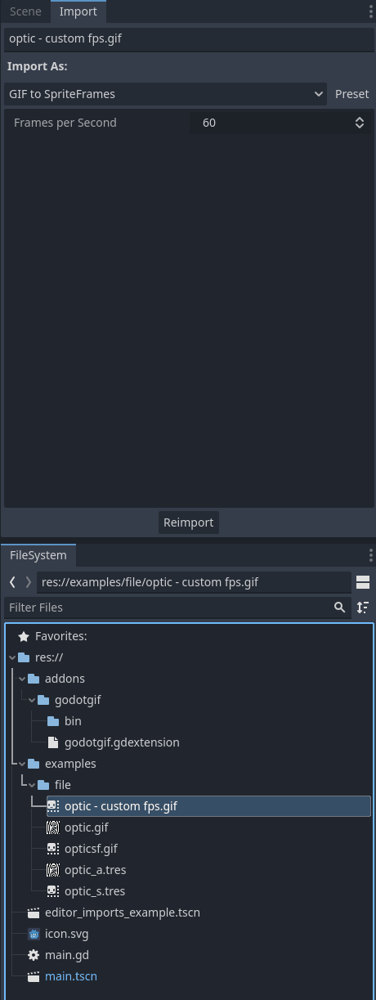
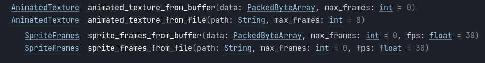

# Godot GIF
<br>

<p align="center">
  
</p>

<p align="center">
	<a href="https://github.com/BOTLANNER/godot-gif/actions/workflows/build_releases.yml"></a>
	<a href="https://github.com/BOTLANNER/godot-gif/blob/develop/LICENSE.txt"></a>
</p>


## Description
GDExtension for Godot 4+ to load GIF files as [AnimatedTexture](https://docs.godotengine.org/en/stable/classes/class_animatedtexture.html) and/or [SpriteFrames](https://docs.godotengine.org/en/stable/classes/class_spriteframes.html).

NOTE: ~~**AnimatedTexture**~~ has been marked as deprecated according to development docs and could be removed in a future version of Godot.


## Usage

### Editor

Gif files can be imported at edit time as one of the supported types via Import options.

<details open>
  <summary>Editor Imports Options</summary>
  

</details>

See the [Editor Imports](./demo/editor_imports_example.tscn) example scene.
<details open>
  <summary>Editor Imports Example</summary>
  

</details>

<hr/>

### Runtime

Gif files can be loaded at runtime as one of the supported types via the `GifManager` singleton.

`GifManager` exposes the following methods for loading gifs either from file or from bytes directly:


e.g. to load from file
```py
get_node("AnimFromRuntimeFile").texture = GifManager.animated_texture_from_file("res://examples/file/optic.gif")

get_node("AnimatedSprite2RuntimeFile").sprite_frames = GifManager.sprite_frames_from_file("res://examples/file/optic.gif")
```

See the [Runtime Imports](./demo/main.tscn) example scene.
<details open>
  <summary>Runtime Imports Example</summary>
  

</details>


## Installation

Download the `gdextension` artifact from the [latest successful build](https://github.com/BOTLANNER/godot-gif/actions/workflows/build_releases.yml). (It should be right at the bottom of the **Summary**)


Extract the contents to your Godot project directory.

You should have an `addons` directory at the root with the following structure:
```bash
└───addons
    └───godotgif
        │   godotgif.gdextension
        │   LICENSE.txt
        │   README.md
        │
        └───bin
            │   godotgif.windows.template_debug.x86_32.dll
            │   godotgif.windows.template_debug.x86_64.dll
            │   godotgif.windows.template_release.x86_32.dll
            │   godotgif.windows.template_release.x86_64.dll
            │   libgodotgif.android.template_debug.arm64.so
            │   libgodotgif.android.template_release.arm64.so
            │   libgodotgif.linux.template_debug.x86_32.so
            │   libgodotgif.linux.template_debug.x86_64.so
            │   libgodotgif.linux.template_release.x86_32.so
            │   libgodotgif.linux.template_release.x86_64.so
            │
            ├───godotgif.macos.template_debug.framework
            │       libgodotgif.macos.template_debug
            │
            └───godotgif.macos.template_release.framework
                    libgodotgif.macos.template_release
```

Open your project. Any exisitng gifs should auto-import. New gifs in the project directory will automatically import as `SpriteFrames`. To convert them into `AnimatedTexture`, update the [import settings](#editor).

The `GifManager` class should also now be available for access within GDScript.

## Contributing

### Setup

Ensure **SCons** is setup. Refer to [Introduction to the buildsystem](https://docs.godotengine.org/en/stable/contributing/development/compiling/introduction_to_the_buildsystem.html)

* If using a different version of Godot, be sure to dump the bindings e.g. 
    ```sh
        godot --dump-extension-api extension_api.json
    ```
*  Compile with 
    ```sh
        scons platform=<platform> custom_api_file=extension_api.json
    ```

### Debugging

This repository is configured for use with [VSCode](https://code.visualstudio.com/)

[Launch configurations](./.vscode/launch.json) have been setup for both debugging in editor and in runtime provided certain **VSCode** extensions are present and environment variables are defined.

The following environment variables are required:

1. `GODOT_PATH` - The directory in which Godot is installed
1. `GODOT_EXECUTABLE` - The executable name of the Godot installation

### More Details
Refer to [GDExtension C++ example](https://docs.godotengine.org/en/stable/tutorials/scripting/gdextension/gdextension_cpp_example.html)


## License

Unless otherwise specified, the extension is released under the
[MIT license](LICENSE.txt).

See the full list of third-party libraries with their licenses used by this
extension at [src/thirdparty/README.md](src/thirdparty/README.md).

This implementation heavily borrowed inspiration from the [gif module](https://github.com/goostengine/goost/tree/gd3/modules/gif) for [Goost](https://github.com/goostengine/goost) that is currently only based on Godot 3
